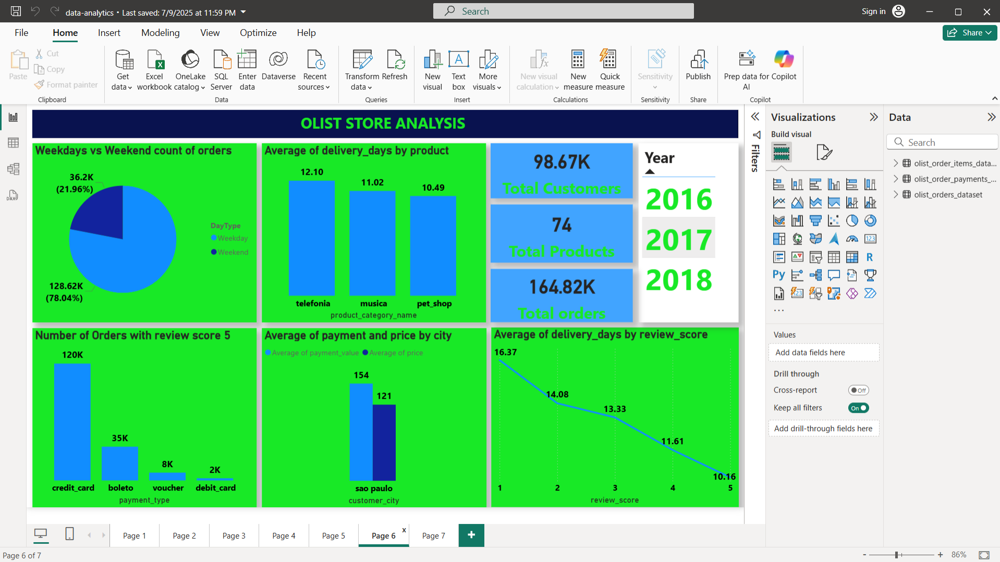

# 🛒 Olist E-Commerce Analytics Dashboard (Power BI)

This project presents a professional Power BI dashboard built using the Olist e-commerce dataset. It delivers insights into customer behavior, sales performance, delivery efficiency, and product trends using real-world data from a Brazilian online marketplace.

---

##  Dashboard Highlights

-  **Total Customers, Orders, and Products**
-  **Order trends by year and day type**
-  **Product-level sales and delivery times**
-  **Payment method performance**
-  **Delivery delays and review-based insights**
-  **City-level insights on payments and pricing**

---

##  Dashboard Previews

### 🔹 Overview Page


_(Add more screenshots like `sales-analysis.png`, `customer-insights.png` if you want)_

---

##  Folder Structure

olist-ecommerce-powerbi/
├── Olist-PowerBI-Dashboard.pbix
├── screenshots/
│ └── dashboard-overview.png
└── data/ # optional: original dataset CSVs


---

## 🛠️ Tools Used

- **Power BI Desktop**
- **Power Query Editor**
- **DAX (Data Analysis Expressions)**
- Olist Dataset from [Kaggle](https://www.kaggle.com/datasets/olistbr/brazilian-ecommerce)

---

##  Dataset Overview

The Olist dataset contains over 100,000 orders from 2016 to 2018 made at multiple marketplaces in Brazil. It includes customer details, product data, seller information, payment, reviews, and geolocation.

---

##  Key DAX Measures Used

```DAX
Total Orders = DISTINCTCOUNT(Orders[order_id])
Total Revenue = SUM(Order_Items[price])
Average Review Score = AVERAGE(Reviews[review_score])
Orders Delivered Late = 
    COUNTROWS(
        FILTER(Orders, Orders[order_delivered_customer_date] > Orders[order_estimated_delivery_date])
    )


